# Stochastic Procedural Texture Generation

Implementation of a stochastic procedural texture generation algorithm based on the method described in the Deliot & Heitz paper. This algorithm generates procedural textures from an input texture using hexagonal tiling and statistical transformations.

## Description

This project implements a procedural texture generation method that transforms an input texture into a larger output texture using:

- A statistical transformation based on a Gaussian distribution
- Hexagonal tiling for procedural generation
- A hash function for stochastic noise
- Barycentric interpolation for value blending

The algorithm generates an output texture that is twice the size of the input texture while preserving the statistical characteristics of the original image.

## Examples

The following examples show input textures alongside their procedurally generated extended versions:

<div align="center">

### Example 1
<table>
<tr>
<td align="center"><b>Input Texture</b></td>
<td align="center"><b>Generated Output (2x scale)</b></td>
</tr>
<tr>
<td>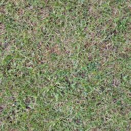</td>
<td>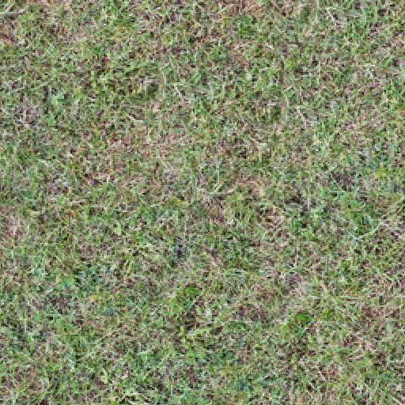</td>
</tr>
</table>

### Example 2
<table>
<tr>
<td align="center"><b>Input Texture</b></td>
<td align="center"><b>Generated Output (2x scale)</b></td>
</tr>
<tr>
<td>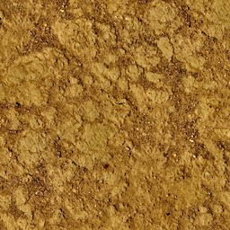</td>
<td>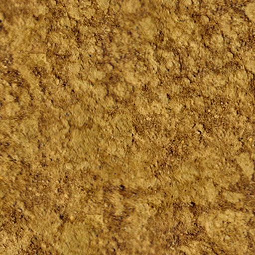</td>
</tr>
</table>

### Example 3
<table>
<tr>
<td align="center"><b>Input Texture</b></td>
<td align="center"><b>Generated Output (2x scale)</b></td>
</tr>
<tr>
<td>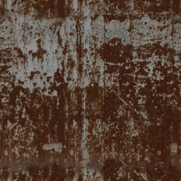</td>
<td>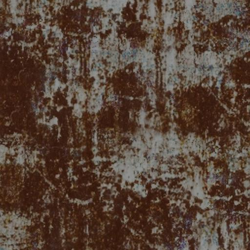</td>
</tr>
</table>

### Example 4
<table>
<tr>
<td align="center"><b>Input Texture</b></td>
<td align="center"><b>Generated Output (2x scale)</b></td>
</tr>
<tr>
<td>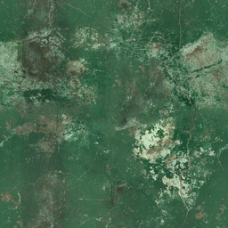</td>
<td>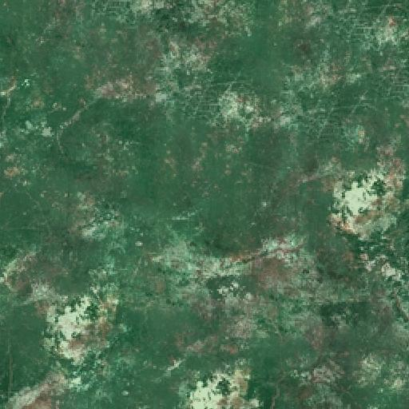</td>
</tr>
</table>

### Example 5
<table>
<tr>
<td align="center"><b>Input Texture</b></td>
<td align="center"><b>Generated Output (2x scale)</b></td>
</tr>
<tr>
<td>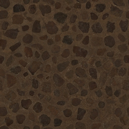</td>
<td>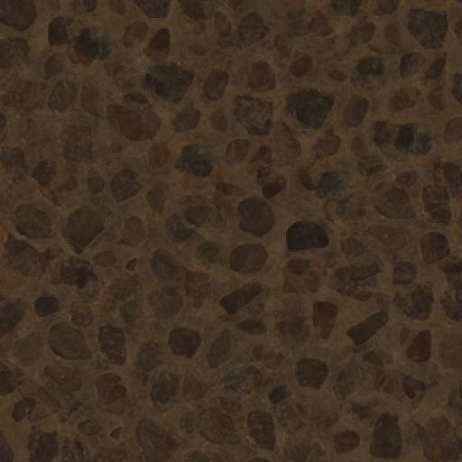</td>
</tr>
</table>

*Note: This example demonstrates a limitation of the algorithm. The input texture contains strong geometric patterns (lines/grids), which the algorithm struggles to preserve. The method relies on global statistical properties rather than local spatial structure, and the hexagonal tiling with barycentric interpolation can introduce artifacts that break the geometric alignment of structured patterns.*

### Example 6
<table>
<tr>
<td align="center"><b>Input Texture</b></td>
<td align="center"><b>Generated Output (2x scale)</b></td>
</tr>
<tr>
<td>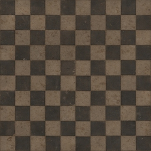</td>
<td></td>
</tr>
</table>

*Note: Similar to Example 5, this texture features pronounced geometric patterns. The algorithm's statistical approach preserves intensity distributions but cannot maintain the precise spatial relationships required for regular geometric structures. The stochastic hash-based sampling and hexagonal tiling introduce randomness that disrupts the original pattern's continuity.*

### Example 7
<table>
<tr>
<td align="center"><b>Input Texture</b></td>
<td align="center"><b>Generated Output (2x scale)</b></td>
</tr>
<tr>
<td>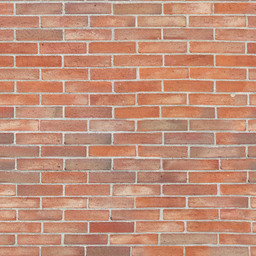</td>
<td>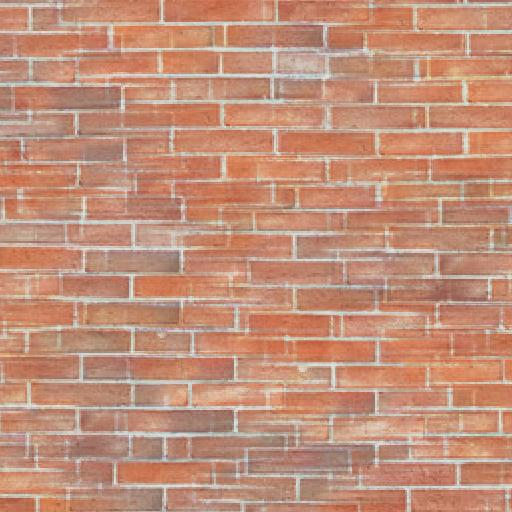</td>
</tr>
</table>

*Note: This example also shows the algorithm's limitations with highly structured textures. When input textures contain strong directional patterns or regular geometric shapes, the method's reliance on statistical transformations and stochastic interpolation fails to capture the spatial coherence. The algorithm works best with stochastic or organic textures where global statistics are more important than exact spatial structure.*

</div>

## Prerequisites

- Python 3.x
- NumPy
- SciPy
- Pillow (PIL)

## Installation

Install the required dependencies:

```bash
pip install numpy scipy pillow
```

Or create a `requirements.txt` file with the following content:

```
numpy
scipy
pillow
```

Then install with:

```bash
pip install -r requirements.txt
```

## Usage

1. Place your input texture in the project directory and name it `texture.jpg`

2. Run the script:

```bash
python app.py
```

3. The generated texture will be saved as `output.jpg` in the same directory

## Parameters

The script contains several configurable parameters at the top of the `app.py` file:

- `GAUSSIAN_AVERAGE`: Mean of the Gaussian distribution (default: 0.5)
- `GAUSSIAN_STD`: Standard deviation of the Gaussian distribution (default: 1/6)
- `LUT_LENGTH`: Length of the lookup table (default: 256)
- `OUTPUT_SCALE_FACTOR`: Scale factor for the output texture (default: 2)

## How It Works

The algorithm works in several steps:

1. **T Transformation**: Converts pixel values from each channel (R, G, B) to values following a Gaussian distribution by sorting pixels by intensity and mapping them to Gaussian quantiles.

2. **Inverse T Transformation (Tinv)**: Creates a lookup table (LUT) that converts Gaussian values back to original intensity values.

3. **Hexagonal Tiling**: Uses hexagonal tiling to determine barycentric coordinates and triangle vertices for each output pixel.

4. **Hash Function**: Generates stochastic values from vertex coordinates to create variation in the texture.

5. **Interpolation and Reconstruction**: Blends Gaussian values from the three vertices using barycentric weights, then converts the result to final intensity value via the LUT.

## Project Structure

```
stochastic-procedural-texture-gen/
├── app.py                 # Main script
├── texture.jpg            # Input texture (to be provided)
├── output.jpg             # Output texture (generated)
└── results/               # Folder containing example results
    ├── texture-*.jpg      # Example input textures
    └── output-*.jpg       # Corresponding output textures
```

## Technical Notes

- The input texture must be in JPEG format and named `texture.jpg`
- The output texture is generated with a scale factor of 2 (width and height doubled)
- The algorithm processes each color channel (R, G, B) independently
- The minimum LUT length is 256 to match 8-bit intensity levels (0-255)

## References

This algorithm is based on the work of Deliot & Heitz on stochastic procedural texture generation.

## License

This project is provided as-is, without any warranty.
